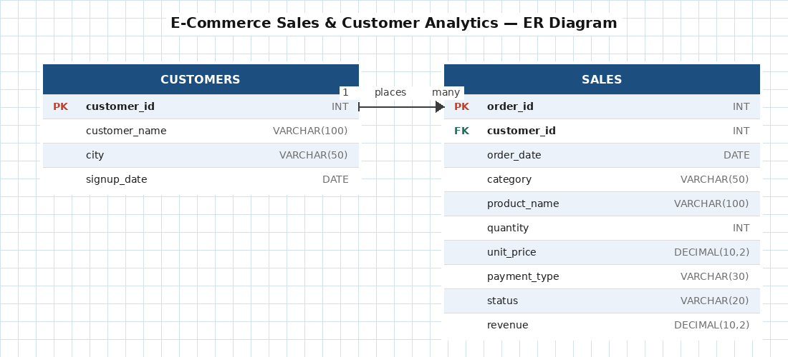
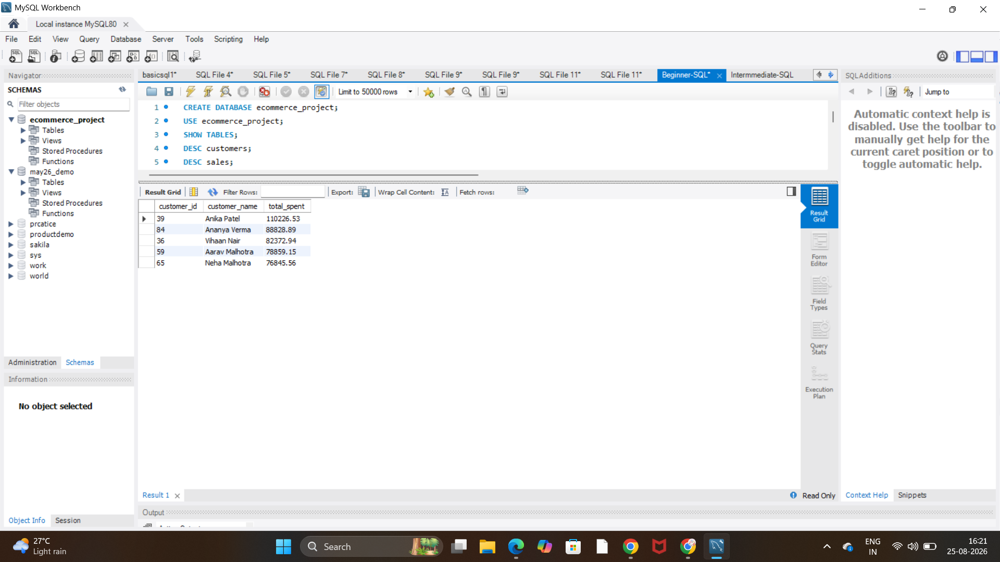
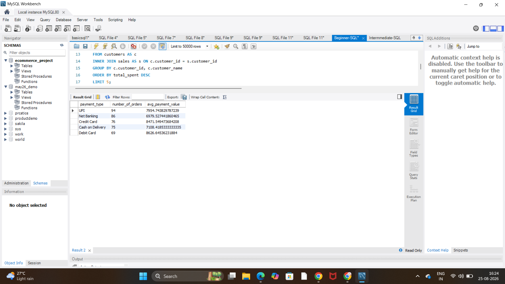
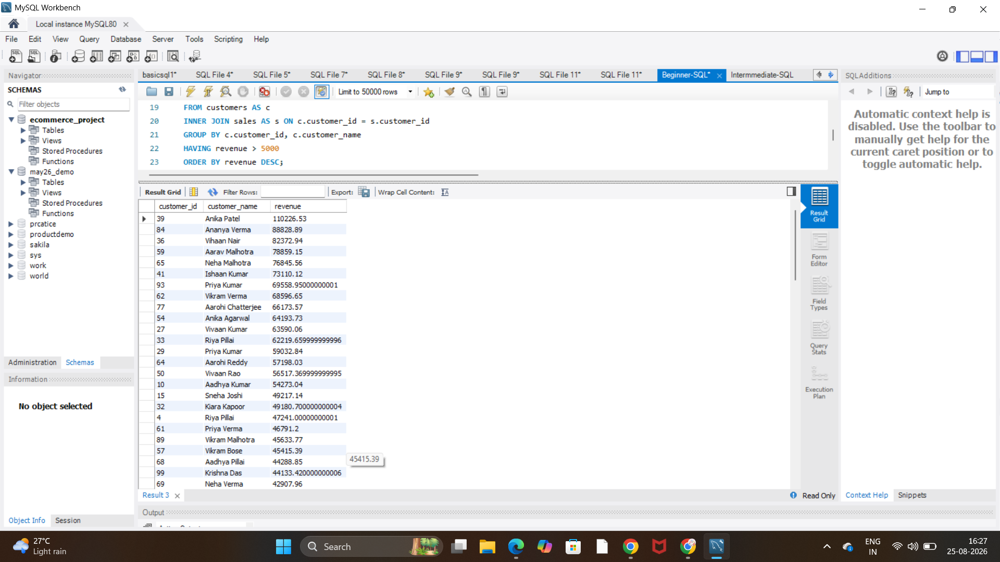
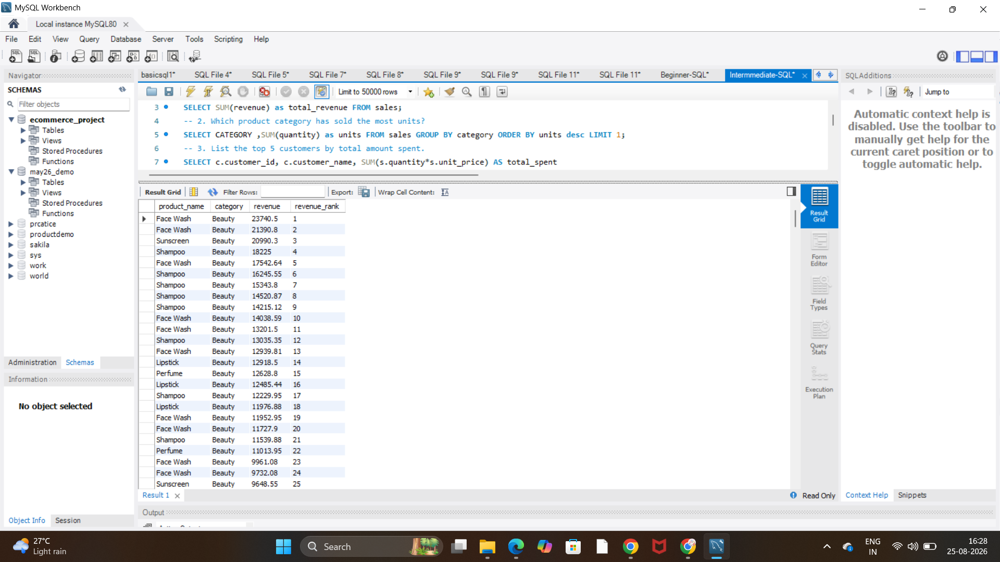
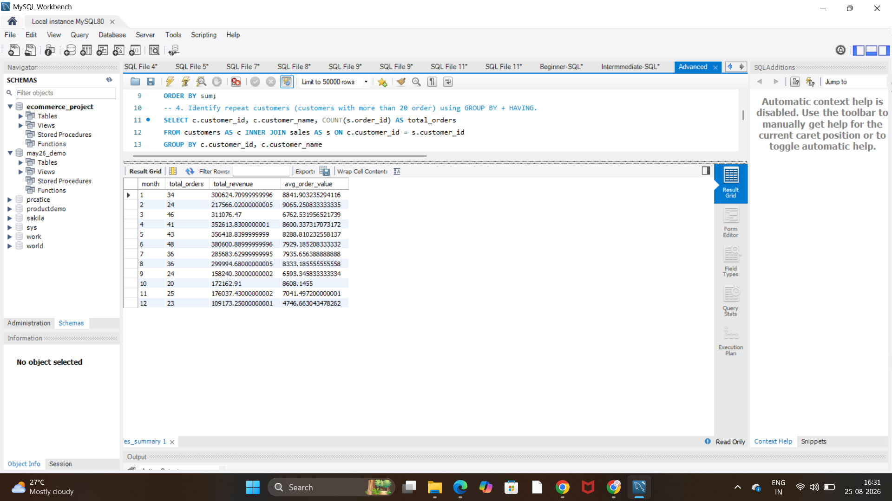

# E-Commerce Sales & Customer Analytics (MySQL)

SQL analysis of an e-commerce platform's sales and customers, covering revenue trends, top customers, and product performance using MySQL.

## Tools Used
- MySQL Workbench

## Dataset
Custom-built dataset consisting of two relational tables — `customers` (100 records) and `sales` (400 order records) — generated to simulate a realistic e-commerce platform with cities, product categories, payment types, and order statuses.

## ER Diagram


`customers` and `sales` are linked in a one-to-many relationship via `customer_id`.

## Key Business Questions Answered

**1. Top 5 customers by total amount spent**
```sql
SELECT c.customer_id, c.customer_name, SUM(s.revenue) AS total_spent
FROM customers AS c 
INNER JOIN sales AS s ON c.customer_id = s.customer_id
GROUP BY c.customer_id, c.customer_name
ORDER BY total_spent DESC
LIMIT 5;
```


**2. Orders and average payment value by payment type**
```sql
SELECT payment_type,
       COUNT(*) AS number_of_orders,
       AVG(quantity * unit_price) AS avg_payment_value
FROM sales
GROUP BY payment_type
ORDER BY number_of_orders DESC;
```


**3. Which sellers/customers generated revenue above a threshold (HAVING)**
```sql
SELECT c.customer_id, c.customer_name, SUM(s.revenue) AS revenue
FROM customers AS c 
INNER JOIN sales AS s ON c.customer_id = s.customer_id
GROUP BY c.customer_id, c.customer_name
HAVING revenue > 5000
ORDER BY revenue DESC;
```


**4. Rank products by revenue within each category (window function)**
```sql
SELECT product_name, category, revenue,
       RANK() OVER (PARTITION BY category ORDER BY revenue DESC) AS revenue_rank
FROM sales;
```


**5. Monthly sales summary view**
```sql
CREATE VIEW monthly_sales_summary AS
SELECT 
    month(order_date) AS sales_month,
    COUNT(*) AS total_orders,
    SUM(revenue) AS total_revenue,
    AVG(revenue) AS avg_order_value
FROM sales
GROUP BY sales_month
ORDER BY sales_month;
```


## What I Learned
Practiced writing multi-table JOINs, GROUP BY/HAVING aggregations, and subqueries to answer real business questions. Practiced window functions for ranking products within categories, and used CTEs for time-based trend analysis. Also built a VIEW for dashboard-ready monthly reporting and a stored procedure to retrieve a customer's full order history on demand.

## Project Structure
```
ecommerce-sql-analytics/
├── README.md
├── schema/
│   └── create_tables.sql
├── data/
│   ├── customers.csv
│   └── sales.csv
├── queries/
│   ├── 01_beginner_questions.sql
│   ├── 02_intermediate_questions.sql
│   └── 03_advanced_questions.sql
└── screenshots/
```
